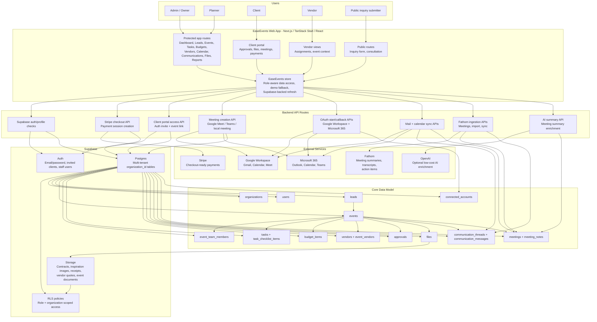
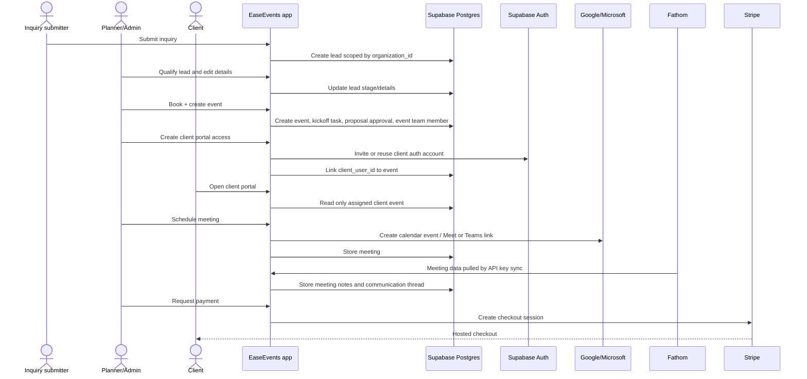

# EaseEvents Architecture

## Key Flows

## Deployment Notes

- The app is multi-tenant from day one through `organization_id` on EaseEvents records.
- Browser clients never receive server-only credentials such as `SUPABASE_SERVICE_ROLE_KEY`, Google/Microsoft client secrets, `FATHOM_API_KEY`, Stripe secret key, or OpenAI API key.
- Supabase RLS protects tenant and role boundaries; server API routes use service-level access only for privileged workflows such as client invites, OAuth token sync, and checkout creation.
- Demo mode remains a local fallback for walkthroughs, but production behavior is Supabase-backed.
